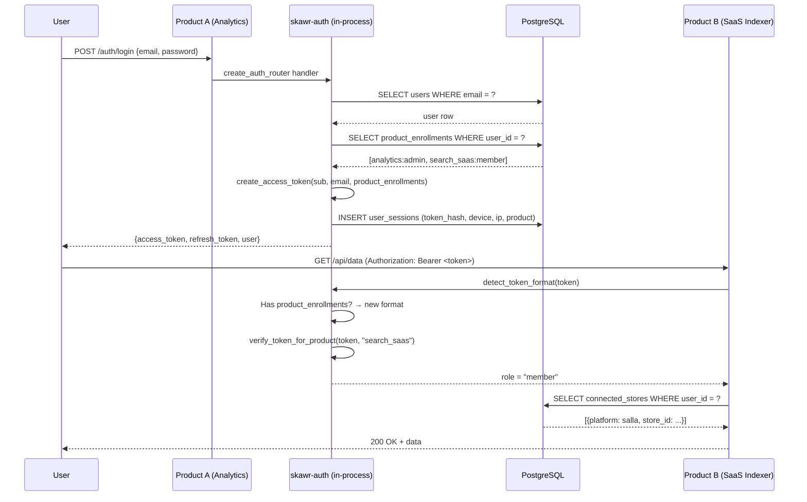
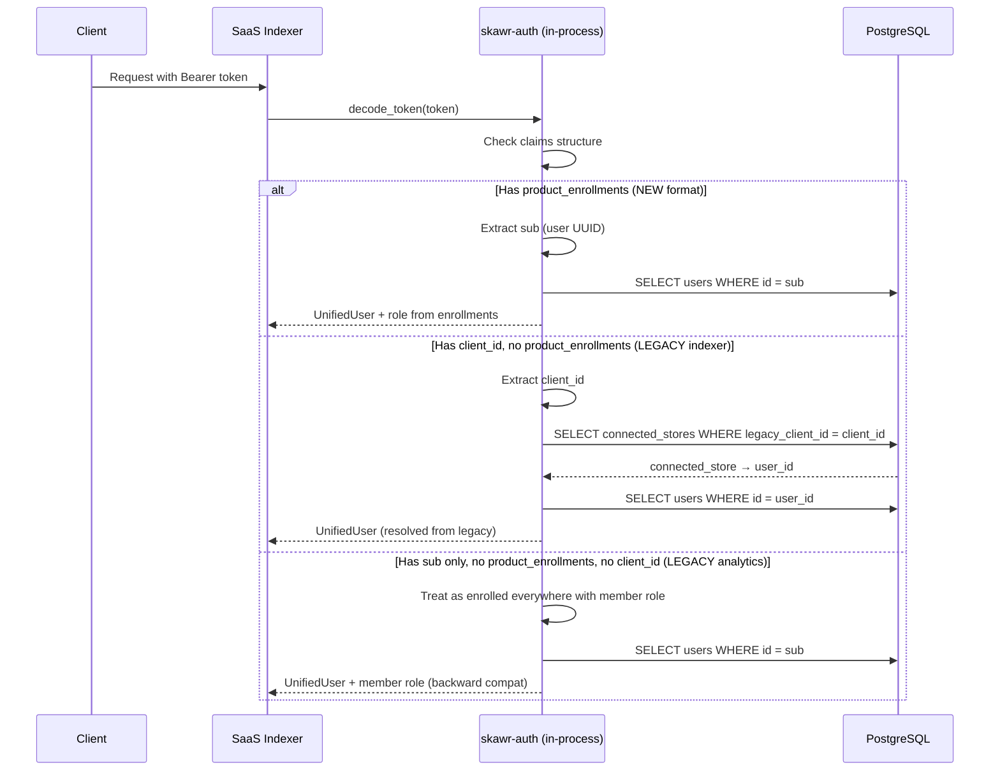
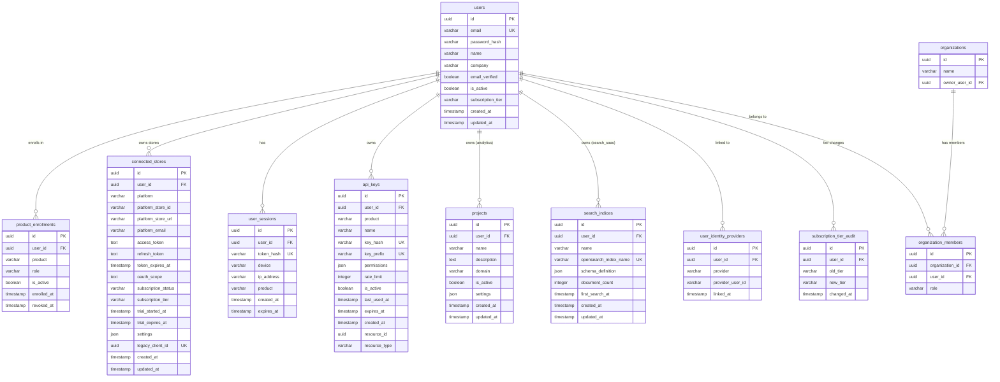

# Design Document: Unified Auth

## Overview

This design transforms `skawr-auth` from a shared-code library (models + routers) into a **shared-identity library** — one user table, one JWT format, one login across Analytics, Search SaaS, Client Dashboard, Admin Dashboard, and Marketplace.

The library remains a pip/npm-installable package (not a standalone service). Each consuming FastAPI app imports it, connects to the same PostgreSQL instance, and gets unified identity for free.

### Phased Delivery

| Phase | Scope | Breaking Changes |
|-------|-------|-----------------|
| Phase 1 | Extended schema, new JWT claims, enrollment logic, connected stores, dual-auth, backward compat | None — old tokens accepted 90 days |
| Phase 2 | Migration scripts (Analytics users, SaaS APIClients → users + connected_stores, Marketplace/Supabase) | None — additive data |
| Phase 3 | SSO frontend components (shared login page, product switcher), legacy token removal | None until day 91 |

### Key Design Decisions

1. **Library, not service** — skawr-auth stays a library. Each FastAPI app shares the same Postgres via connection string.
2. **Extend, don't replace** — the existing `users` table gains columns; it is not recreated.
3. **Additive JWT claims** — `product_enrollments` is added; `sub`, `email`, `iat`, `exp` remain unchanged.
4. **90-day backward compat** — tokens missing `product_enrollments` are treated as "enrolled everywhere with member role."
5. **Dual-auth transition** — the indexer accepts BOTH legacy `client_id` tokens AND new unified tokens simultaneously.
6. **Connected stores model** — Salla/Shopify OAuth data migrates from APIClient columns to a dedicated `connected_stores` table owned by the unified user.
7. **Sync/Async support** — the library provides both sync and async session interfaces so the indexer (sync SQLAlchemy) and analytics (async SQLAlchemy) both work.
8. **Future-ready schema** — `organizations` and `user_identity_providers` tables are created but dormant.
9. **Unified secret key** — all services share `SKAWR_AUTH_SECRET_KEY`; indexer's `JWT_SECRET_KEY` becomes an alias.
10. **Postgres sessions as source of truth** — refresh token revocation tracked in `user_sessions` table, with optional Redis cache.


### Rollout Sequence

The exact deployment order to ensure zero downtime:

1. **Deploy schema migrations** (additive only — new tables, new columns, nothing dropped)
2. **Deploy skawr-auth library v2** (backward compat — accepts both old and new tokens)
3. **Deploy analytics backend** (now issues unified tokens, still accepts old)
4. **Run analytics user migration script**
5. **Deploy indexer with dual-auth** (accepts both legacy `client_id` tokens AND new unified tokens)
6. **Run APIClient migration script** (creates users, connected_stores, re-associates resources)
7. **Deploy dashboard-client** to use new auth endpoints
8. **Run marketplace/Supabase migration** (later, lower priority)
9. **After 90 days**: Remove legacy token support, drop backward compat code

## Architecture

### High-Level System Diagram

```mermaid
graph TD
    subgraph "Consuming FastAPI Services"
        A[Analytics Backend<br/>async SQLAlchemy]
        B[SaaS Indexer<br/>sync SQLAlchemy]
        C[Client Dashboard]
        D[Admin Dashboard]
        E[Marketplace Backend]
    end

    subgraph "skawr-auth library (imported)"
        F[Auth Router]
        G[JWT Utils + Dual-Auth]
        H[Enrollment Logic]
        I[Session Manager]
        J[API Key Auth]
        K[Role Dependency]
        L[Resource Resolver]
    end

    subgraph "Shared PostgreSQL"
        M[(users)]
        N[(product_enrollments)]
        O[(user_sessions)]
        P[(api_keys)]
        Q[(connected_stores)]
        R[(organizations - dormant)]
        S[(user_identity_providers - dormant)]
        T[(subscription_tier_audit)]
    end

    subgraph "Frontend Libraries"
        U[@skawr/auth-frontend]
        V[Product Switcher Component]
        W[Shared Login Page]
    end

    A --> F
    B --> F
    C --> F
    D --> F
    E --> F

    F --> G
    F --> H
    F --> I
    F --> J
    F --> K
    F --> L

    G --> M
    H --> N
    I --> O
    J --> P
    K --> N
    L --> Q

    U --> F
    V --> F
    W --> F
```


### Request Flow (Login → Cross-Product Access)



### Dual-Auth Flow (Indexer Transition Period)




## Components and Interfaces

### Backend Components

#### 1. Extended User Model (`models/user.py`)

The existing `User` model gains one new column. The factory pattern is preserved.

```python
def create_user_models(base_class=None):
    Base = get_base(base_class)

    class User(Base):
        __tablename__ = "users"
        # Existing columns preserved exactly
        id = Column(UUID(as_uuid=True), primary_key=True, default=uuid.uuid4)
        email = Column(String(255), unique=True, index=True, nullable=False)
        password_hash = Column(String(255), nullable=True)  # nullable for OAuth-only
        name = Column(String(255), nullable=True)
        company = Column(String(255), nullable=True)
        email_verified = Column(Boolean, default=False, nullable=False)
        is_active = Column(Boolean, default=True, nullable=False)
        created_at = Column(DateTime(timezone=True), server_default=func.now())
        updated_at = Column(DateTime(timezone=True), server_default=func.now(), onupdate=func.now())
        # NEW
        subscription_tier = Column(String(20), nullable=True)  # trial|starter|growth|scale|enterprise

        enrollments = relationship("ProductEnrollment", back_populates="user", lazy="selectin")
        sessions = relationship("UserSession", back_populates="user", lazy="dynamic")
        connected_stores = relationship("ConnectedStore", back_populates="user", lazy="selectin")
```

#### 2. Product Enrollment Model (`models/enrollment.py`)

```python
class ProductEnrollment(Base):
    __tablename__ = "product_enrollments"

    id = Column(UUID(as_uuid=True), primary_key=True, default=uuid.uuid4)
    user_id = Column(UUID(as_uuid=True), ForeignKey("users.id"), nullable=False, index=True)
    product = Column(String(50), nullable=False)  # analytics, search_saas, etc.
    role = Column(String(20), nullable=False, default="member")  # admin, member, viewer
    is_active = Column(Boolean, default=True, nullable=False)
    enrolled_at = Column(DateTime(timezone=True), server_default=func.now())
    revoked_at = Column(DateTime(timezone=True), nullable=True)

    __table_args__ = (UniqueConstraint("user_id", "product", name="uq_user_product"),)
    user = relationship("User", back_populates="enrollments")
```

#### 3. Connected Stores Model (`models/connected_store.py`) — NEW

Migrated from the 15+ Salla/Shopify columns on `APIClient`. One user can own multiple stores.

```python
class ConnectedStore(Base):
    __tablename__ = "connected_stores"

    id = Column(UUID(as_uuid=True), primary_key=True, default=uuid.uuid4)
    user_id = Column(UUID(as_uuid=True), ForeignKey("users.id"), nullable=False, index=True)
    platform = Column(String(20), nullable=False)  # "salla" or "shopify"
    platform_store_id = Column(String(100), nullable=False, index=True)  # Salla store ID or Shopify shop ID
    platform_store_url = Column(String(500), nullable=True)
    platform_email = Column(String(255), nullable=True)

    # OAuth tokens (encrypted at rest via pgcrypto or application-level encryption)
    access_token = Column(Text, nullable=True)
    refresh_token = Column(Text, nullable=True)
    token_expires_at = Column(DateTime(timezone=True), nullable=True)
    oauth_scope = Column(Text, nullable=True)  # Shopify granted scopes

    # Subscription state (migrated from salla_subscription_* fields)
    subscription_status = Column(String(50), nullable=True)  # active, canceled, expired, trial
    subscription_tier = Column(String(50), nullable=True)  # pro, enterprise, etc.
    trial_started_at = Column(DateTime(timezone=True), nullable=True)
    trial_expires_at = Column(DateTime(timezone=True), nullable=True)

    # Platform-specific settings (JSON blob for flexibility)
    settings = Column(JSON, nullable=True)

    # Back-reference to legacy APIClient UUID (for migration resolution)
    legacy_client_id = Column(UUID(as_uuid=True), nullable=True, unique=True, index=True)

    created_at = Column(DateTime(timezone=True), server_default=func.now())
    updated_at = Column(DateTime(timezone=True), server_default=func.now(), onupdate=func.now())

    __table_args__ = (
        UniqueConstraint("platform", "platform_store_id", name="uq_platform_store"),
    )

    user = relationship("User", back_populates="connected_stores")
```


#### 4. Enhanced Session Model (`models/session.py`)

Postgres is the source of truth for refresh token revocation (replacing the indexer's Redis-only approach). An optional Redis cache speeds up hot-path validation.

```python
class UserSession(Base):
    __tablename__ = "user_sessions"

    id = Column(UUID(as_uuid=True), primary_key=True, default=uuid.uuid4)
    user_id = Column(UUID(as_uuid=True), ForeignKey("users.id"), nullable=False, index=True)
    token_hash = Column(String(255), nullable=False, unique=True)
    device = Column(String(512), nullable=True)
    ip_address = Column(String(45), nullable=True)  # IPv6 max
    product = Column(String(50), nullable=True)      # originating product
    created_at = Column(DateTime(timezone=True), server_default=func.now())
    expires_at = Column(DateTime(timezone=True), nullable=False)

    user = relationship("User", back_populates="sessions")
```

**Revocation strategy**: On token refresh, check `user_sessions` for a valid (non-expired, not-deleted) row matching the refresh token hash. If missing → reject. Redis caches active session IDs with TTL matching the refresh token lifetime — cache miss falls through to Postgres.

**Transition**: During migration, the indexer's existing Redis JTIs continue to work for legacy tokens. New unified tokens use `user_sessions` exclusively.

#### 5. Extended API Keys Model (`models/api_key.py`)

```python
class APIKey(Base):
    __tablename__ = "api_keys"

    id = Column(UUID(as_uuid=True), primary_key=True, default=uuid.uuid4)
    user_id = Column(UUID(as_uuid=True), ForeignKey("users.id"), nullable=False, index=True)
    product = Column(String(50), nullable=False)  # analytics, search_saas, etc.
    name = Column(String(255), nullable=True)
    key_hash = Column(String(256), nullable=False, unique=True)
    key_prefix = Column(String(8), unique=True, nullable=False)
    permissions = Column(JSON, default=[], nullable=False)  # ["track", "query", "search", "index"]
    rate_limit = Column(Integer, nullable=True)
    is_active = Column(Boolean, default=True, nullable=False)
    last_used_at = Column(DateTime(timezone=True), nullable=True)
    expires_at = Column(DateTime(timezone=True), nullable=True)
    created_at = Column(DateTime(timezone=True), server_default=func.now())

    # Polymorphic resource binding — NEW
    resource_id = Column(UUID(as_uuid=True), nullable=True, index=True)
    resource_type = Column(String(50), nullable=True)  # "project", "search_index", etc.

    user = relationship("User")

    __table_args__ = (
        Index("idx_api_keys_user_product", "user_id", "product"),
        # Enforce max 10 keys per user per product at application level
    )
```

**`resource_id` + `resource_type` semantics**:
- For analytics: `resource_id` = project UUID, `resource_type` = "project"
- For search_saas: `resource_id` = search_index UUID, `resource_type` = "search_index"
- For unscoped keys: both are NULL (key works on all resources the user owns in that product)

This replaces the indexer's `search_index_id` FK and the analytics' implicit project binding.


#### 6. Future-Ready Models (dormant)

```python
class Organization(Base):
    __tablename__ = "organizations"
    id = Column(UUID(as_uuid=True), primary_key=True, default=uuid.uuid4)
    name = Column(String(255), nullable=False)
    owner_user_id = Column(UUID(as_uuid=True), ForeignKey("users.id"), nullable=False)

class OrganizationMember(Base):
    __tablename__ = "organization_members"
    id = Column(UUID(as_uuid=True), primary_key=True, default=uuid.uuid4)
    organization_id = Column(UUID(as_uuid=True), ForeignKey("organizations.id"), nullable=False)
    user_id = Column(UUID(as_uuid=True), ForeignKey("users.id"), nullable=False)
    role = Column(String(20), nullable=False, default="member")  # owner, admin, member

class UserIdentityProvider(Base):
    __tablename__ = "user_identity_providers"
    id = Column(UUID(as_uuid=True), primary_key=True, default=uuid.uuid4)
    user_id = Column(UUID(as_uuid=True), ForeignKey("users.id"), nullable=False)
    provider = Column(String(50), nullable=False)  # google, github
    provider_user_id = Column(String(255), nullable=False)
    linked_at = Column(DateTime(timezone=True), server_default=func.now())
    __table_args__ = (UniqueConstraint("provider", "provider_user_id"),)

class SubscriptionTierAudit(Base):
    __tablename__ = "subscription_tier_audit"
    id = Column(UUID(as_uuid=True), primary_key=True, default=uuid.uuid4)
    user_id = Column(UUID(as_uuid=True), ForeignKey("users.id"), nullable=False, index=True)
    old_tier = Column(String(20), nullable=True)
    new_tier = Column(String(20), nullable=True)
    changed_at = Column(DateTime(timezone=True), server_default=func.now())
```

#### 7. JWT Utilities (`utils/auth.py` — extended)

New public functions added alongside existing ones. Supports dual-auth token detection.

```python
def _get_secret_key(secret_key: Optional[str] = None) -> str:
    """Canonical secret key resolution. Checks SKAWR_AUTH_SECRET_KEY first,
    falls back to SECRET_KEY (legacy analytics) and JWT_SECRET_KEY (legacy indexer)."""
    return (
        secret_key
        or os.getenv("SKAWR_AUTH_SECRET_KEY")
        or os.getenv("SECRET_KEY")
        or os.getenv("JWT_SECRET_KEY")
        or DEFAULT_SECRET_KEY
    )

def detect_token_format(payload: dict) -> str:
    """Classify a decoded JWT payload into one of three formats.
    
    Returns:
        "unified" — has product_enrollments claim (new format)
        "legacy_indexer" — has client_id claim, no product_enrollments
        "legacy_analytics" — has sub only, no product_enrollments, no client_id
    
    Raises ValueError if token structure is unrecognizable.
    """
    if "product_enrollments" in payload:
        return "unified"
    if "client_id" in payload and "product_enrollments" not in payload:
        return "legacy_indexer"
    if "sub" in payload and "client_id" not in payload:
        return "legacy_analytics"
    raise ValueError("Unrecognizable token format")

def verify_token_for_product(
    token: str,
    product: str,
    secret_key: Optional[str] = None,
    algorithm: Optional[str] = None,
) -> Optional[str]:
    """
    Verify token and return the user's role for the specified product.
    Returns None if token invalid or user has no enrollment for that product.
    
    Handles all three token formats:
    - Unified: checks product_enrollments claim
    - Legacy analytics: treats as enrolled everywhere with 'member' role (90-day window)
    - Legacy indexer: resolves client_id → connected_store → user, returns 'admin' role
    """

def create_access_token(data: dict, ...) -> str:
    """Extended: now includes email and product_enrollments in claims."""

def create_get_current_user_dependency(user_model, db_dependency, product: Optional[str] = None):
    """
    Extended factory: if product is specified, also validates product enrollment.
    If product is None, behaves identically to the old implementation.
    Supports both AsyncSession and Session (sync) via runtime detection.
    """
```


#### 8. Resource Resolver (`utils/resource_resolver.py`) — NEW

The indexer's `get_current_client()` reads `payload.get("client_id")` from JWT. After migration, tokens have `sub` = user UUID. This module bridges the gap.

```python
def get_current_user_resources(
    db,  # Session or AsyncSession — duck-typed
    user_id: UUID,
    product: str,
) -> UserResources:
    """
    Resolve a user's resources for a specific product.
    
    For search_saas:
        - connected_stores (Salla/Shopify stores)
        - search_indices (via user_id on SearchIndex after migration)
        - api_keys (scoped to search_saas)
    
    For analytics:
        - projects (via user_id on Project)
        - api_keys (scoped to analytics)
    
    Returns a UserResources dataclass with product-specific attributes.
    """

@dataclass
class UserResources:
    user_id: UUID
    product: str
    connected_stores: list  # ConnectedStore rows (search_saas only)
    search_indices: list    # SearchIndex rows (search_saas only)
    projects: list          # Project rows (analytics only)
    api_keys: list          # APIKey rows scoped to this product


def get_current_user_or_legacy_client(
    request: Request,
    credentials: Optional[HTTPAuthorizationCredentials],
    db,  # Session (sync) for indexer
) -> Union[UnifiedUser, LegacyClient]:
    """
    Drop-in replacement for the indexer's get_current_client().
    
    1. Check request.state.client (API key middleware already resolved)
    2. If Bearer token:
       a. Decode token
       b. detect_token_format()
       c. If "unified" or "legacy_analytics": look up user by sub
       d. If "legacy_indexer": look up connected_store by legacy_client_id,
          then resolve to user
    3. Return UnifiedUser (wraps user + their connected stores) or
       LegacyClient (backward compat during transition)
    """
```

**For API key auth in the indexer**: The key → lookup user_id on the key → validate key's product scope matches "search_saas" → resolve the user's connected stores and search indices.

#### 9. Sync/Async Database Support

The indexer uses **sync SQLAlchemy** (`Session`), while skawr-auth and analytics use **async** (`AsyncSession`). The library must support both.

```python
# utils/db_compat.py
def execute_query(db, stmt):
    """Execute a SQLAlchemy statement on either sync or async session."""
    if hasattr(db, 'execute') and asyncio.iscoroutinefunction(db.execute):
        # Async path — caller must await
        return db.execute(stmt)
    else:
        # Sync path — returns result directly
        return db.execute(stmt)

def get_scalar_one_or_none(result):
    """Extract scalar from either sync or async result."""
    return result.scalar_one_or_none()
```

Alternative (preferred): Provide **two dependency factories** — one sync, one async:

```python
# For analytics (async)
get_current_user = create_get_current_user_dependency_async(User, get_async_db, product="analytics")

# For indexer (sync)  
get_current_user = create_get_current_user_dependency_sync(User, get_sync_db, product="search_saas")
```


#### 10. Enrollment Service (`services/enrollment.py`)

```python
async def get_or_create_enrollment(
    db: AsyncSession, user_id: UUID, product: str, default_role: str = "member"
) -> ProductEnrollment:
    """Ensures an enrollment exists. Creates with default_role if missing."""

async def get_user_enrollments(db: AsyncSession, user_id: UUID) -> list[ProductEnrollment]:
    """Returns all active enrollments for a user."""

async def revoke_all_enrollments(db: AsyncSession, user_id: UUID) -> None:
    """Marks all enrollments as revoked (called when user deactivated)."""

async def restore_all_enrollments(db: AsyncSession, user_id: UUID) -> None:
    """Restores previously revoked enrollments (called when user reactivated)."""

async def assign_role(
    db: AsyncSession, user_id: UUID, product: str, role: str, actor_role: str
) -> ProductEnrollment:
    """Assigns a role. Raises PermissionError if actor_role != admin."""
```

#### 11. Session Service (`services/sessions.py`)

```python
async def create_session(
    db: AsyncSession, user_id: UUID, token_hash: str,
    device: Optional[str], ip: Optional[str], product: Optional[str],
    expires_at: datetime,
) -> UserSession:

async def list_user_sessions(db: AsyncSession, user_id: UUID) -> list[dict]:
    """Returns non-expired sessions, excluding token_hash."""

async def revoke_session(db: AsyncSession, user_id: UUID, session_id: UUID) -> bool:
    """Revokes single session. Returns False if not found/not owned."""

async def revoke_all_sessions(db: AsyncSession, user_id: UUID) -> int:
    """Revokes all user sessions. Returns count."""

async def cleanup_expired_sessions(db: AsyncSession, user_id: UUID) -> int:
    """Removes expired sessions. Called during token refresh."""

async def is_session_valid(db: AsyncSession, token_hash: str) -> bool:
    """Check if a refresh token session is still valid (not revoked, not expired).
    Checks Redis cache first, falls through to Postgres on miss."""
```

#### 12. Guest Claim Flow (`services/guest_claim.py`) — NEW

When a guest client (is_guest=true, no email/password) later adds credentials:

```python
async def claim_guest_account(
    db: AsyncSession,
    legacy_client_id: UUID,
    email: str,
    password_hash: str,
    name: Optional[str] = None,
) -> User:
    """
    Convert a guest APIClient into a unified user.
    
    Steps:
    1. Check email doesn't already exist in users table
    2. Create unified user with provided email/password
    3. Create search_saas enrollment (role=admin)
    4. Create connected_store record (if store data exists on APIClient)
    5. Re-associate existing SearchIndex and APIKey rows to new user_id
    6. Mark the APIClient.is_guest = False, set terms_accepted_at
    
    If email already exists: add search_saas enrollment to existing user,
    re-associate resources to that user (merge behavior).
    """
```

#### 13. Role Dependency (`utils/roles.py`)

```python
from enum import Enum

class Product(str, Enum):
    ANALYTICS = "analytics"
    SEARCH_SAAS = "search_saas"
    CLIENT_DASHBOARD = "client_dashboard"
    ADMIN_DASHBOARD = "admin_dashboard"
    MARKETPLACE = "marketplace"

class Role(str, Enum):
    ADMIN = "admin"
    MEMBER = "member"
    VIEWER = "viewer"

def require_product_role(product: Product, min_role: Role = Role.VIEWER):
    """
    FastAPI dependency factory. Extracts role from JWT product_enrollments claim.
    Returns 403 if user lacks enrollment or insufficient role.
    """
```

#### 14. Subscription Tier Endpoint (`endpoints/subscription.py`)

```python
@router.put("/internal/subscription-tier/{user_id}")
async def update_subscription_tier(
    user_id: UUID,
    tier: SubscriptionTierUpdate,
    api_key: Tuple = Depends(require_service_api_key),
    db: AsyncSession = Depends(db_dependency),
):
    """
    Internal-only endpoint. Authenticated via service-level API key.
    Records old value, new value, and timestamp in subscription_tier_audit.
    """
```


### Frontend Components

#### 15. Extended AuthClient (`utils/auth-client.ts`)

```typescript
// Existing public API preserved
export class AuthClient {
  // New: product-aware login
  async login(data: LoginRequest & { product?: string }): Promise<AuthResponse>

  // New: get enrolled products from current token
  getEnrolledProducts(): ProductEnrollment[]

  // New: check if user has access to specific product
  hasProductAccess(product: string): boolean
}
```

#### 16. Product Switcher Component (`components/ProductSwitcher.tsx`)

```typescript
export interface ProductSwitcherProps {
  products: ProductEnrollment[]
  currentProduct: string
  onSwitch: (product: string) => void
}

export function ProductSwitcher(props: ProductSwitcherProps): JSX.Element
```

#### 17. Shared Login Page (`components/SharedLoginPage.tsx`)

```typescript
export interface SharedLoginPageProps {
  config: AuthConfig
  redirectProduct?: string  // Which product to redirect to after login
  onSuccess?: (user: User) => void
}

export function SharedLoginPage(props: SharedLoginPageProps): JSX.Element
```

### Public API Surface (preserved + extended)

| Export | Status | Notes |
|--------|--------|-------|
| `create_user_models()` | Unchanged signature | Returns extended User + enhanced UserSession + ConnectedStore |
| `create_project_models()` | Unchanged | No changes |
| `create_auth_router()` | Unchanged signature | Internal logic adds enrollment + session tracking |
| `create_projects_router()` | Unchanged | No changes |
| `create_auth_dependencies()` | Unchanged signature | Now supports product-scoped validation |
| `create_api_key_dependencies()` | Unchanged signature | API keys gain product scope + resource binding |
| `verify_token()` | Unchanged | Returns payload including new claims |
| **NEW** `verify_token_for_product()` | New | Returns role or None |
| **NEW** `detect_token_format()` | New | Classifies token as unified/legacy_indexer/legacy_analytics |
| **NEW** `create_enrollment_models()` | New | Factory for enrollment model |
| **NEW** `create_connected_store_models()` | New | Factory for connected_store model |
| **NEW** `create_session_router()` | New | Router for session CRUD |
| **NEW** `require_product_role()` | New | Dependency for product-scoped access |
| **NEW** `get_current_user_resources()` | New | Resolve user → product resources |
| **NEW** `create_get_current_user_dependency_sync()` | New | Sync variant for indexer |
| **NEW** `claim_guest_account()` | New | Convert guest → unified user |


## Data Models

### Entity Relationship Diagram




### JWT Claim Structure

**Access Token (new unified format)**:
```json
{
  "sub": "uuid-of-user",
  "email": "user@example.com",
  "product_enrollments": [
    {"product": "analytics", "role": "admin"},
    {"product": "search_saas", "role": "member"}
  ],
  "type": "access",
  "iat": 1700000000,
  "exp": 1700000900
}
```

**Legacy Indexer Token (accepted during 90-day transition)**:
```json
{
  "sub": "uuid-of-apiclient",
  "client_id": "uuid-of-apiclient",
  "email": "merchant@example.com",
  "type": "access",
  "jti": "random-uuid",
  "iat": 1700000000,
  "exp": 1700000900
}
```

**Legacy Analytics Token (accepted during 90-day transition)**:
```json
{
  "sub": "uuid-of-user",
  "type": "access",
  "iat": 1700000000,
  "exp": 1700000900
}
```

**Token format detection rules** (strict):
- Has `product_enrollments` → **unified** (new format)
- Has `client_id` AND no `product_enrollments` → **legacy indexer**
- Has `sub` only, no `client_id`, no `product_enrollments` → **legacy analytics**
- Anything else → **REJECT** (invalid token structure)

### SECRET_KEY Standardization

| Service | Current Env Var | After Migration |
|---------|----------------|-----------------|
| skawr-auth library | `SECRET_KEY` | `SKAWR_AUTH_SECRET_KEY` (primary) |
| Analytics backend | `SECRET_KEY` | `SKAWR_AUTH_SECRET_KEY` (primary), `SECRET_KEY` (alias) |
| Indexer | `JWT_SECRET_KEY` | `SKAWR_AUTH_SECRET_KEY` (primary), `JWT_SECRET_KEY` (alias) |

The `_get_secret_key()` function checks env vars in order: `SKAWR_AUTH_SECRET_KEY` → `SECRET_KEY` → `JWT_SECRET_KEY`. In production docker-compose, a single env var `SKAWR_AUTH_SECRET_KEY` is injected into ALL containers. The aliases remain for backward compat during transition.

### Environment Configuration

| Variable | Used By | Required | Default | Purpose |
|----------|---------|----------|---------|---------|
| `SKAWR_AUTH_SECRET_KEY` | All | Yes | None | JWT signing key (canonical name) |
| `SKAWR_AUTH_DB_URL` | All | Yes | None | Shared Postgres connection string |
| `SKAWR_AUTH_ALGORITHM` | All | No | `HS256` | JWT algorithm |
| `SKAWR_AUTH_ACCESS_EXPIRE_MINUTES` | All | No | `15` | Access token lifetime |
| `SKAWR_AUTH_REFRESH_EXPIRE_DAYS` | All | No | `30` | Refresh token lifetime |
| `SKAWR_AUTH_ALLOWED_ORIGINS` | All | No | (see CORS) | CORS origins (JSON array) |
| `SKAWR_AUTH_LEGACY_TOKEN_DEADLINE` | All | No | 90 days from deploy | ISO date when legacy tokens stop working |
| `SECRET_KEY` | Analytics | No | — | Alias for `SKAWR_AUTH_SECRET_KEY` (backward compat) |
| `JWT_SECRET_KEY` | Indexer | No | — | Alias for `SKAWR_AUTH_SECRET_KEY` (backward compat) |
| `SKAWR_AUTH_REDIS_URL` | All | No | None | Optional Redis for session cache |
| `SKAWR_AUTH_STORE_ENCRYPTION_KEY` | All | No | None | Fernet key for encrypting connected_store tokens |


### CORS Strategy

SSO means auth endpoints accept requests from all product frontends. The library provides a CORS configuration helper:

```python
# utils/cors.py
def get_allowed_origins() -> list[str]:
    """Get CORS allowed origins from environment or defaults."""
    env_origins = os.getenv("SKAWR_AUTH_ALLOWED_ORIGINS")
    if env_origins:
        return json.loads(env_origins)
    
    # Defaults per environment
    environment = os.getenv("ENVIRONMENT", "local")
    if environment in ("local", "test"):
        return ["http://localhost:*"]
    elif environment == "production":
        return [
            "https://analytics.ziyad.one",
            "https://skawr.com",
            "https://*.ziyad.one",
        ]
    return ["http://localhost:*"]
```

Each consuming service includes skawr-auth's CORS origins in its own CORS middleware configuration. The library exports `get_allowed_origins()` for this purpose.

### Alembic Migration Plan

Schema changes are delivered as Alembic migrations (additive only — nothing dropped):

1. `add_subscription_tier_to_users` — adds nullable `subscription_tier` column
2. `make_password_hash_nullable` — for OAuth-only users
3. `create_product_enrollments_table`
4. `enhance_user_sessions_table` — adds `device`, `ip_address`, `product` columns
5. `create_connected_stores_table` — NEW: platform store data
6. `add_product_scope_to_api_keys` — adds `user_id`, `product`, `resource_id`, `resource_type` columns
7. `create_organizations_tables` — organizations + organization_members (dormant)
8. `create_user_identity_providers_table` (dormant)
9. `create_subscription_tier_audit_table`
10. `add_user_id_to_search_indices` — NEW: adds `user_id` FK to search_indices (nullable initially)

### Migration Scripts (Phase 2 — standalone Python)

These are NOT Alembic migrations. They are standalone scripts for data migration:

- `migrate_analytics_users.py` — copies analytics users → unified, creates enrollments
- `migrate_saas_apiclients.py` — converts APIClients → users + connected_stores, re-associates keys/indices
- `migrate_marketplace_supabase.py` — exports Supabase users → unified

All scripts are idempotent (UUID-based dedup), log conflicts, and output summary reports.

**APIClient migration detail** (`migrate_saas_apiclients.py`):

```python
# For each APIClient with non-null email:
# 1. Create or find unified user (email match → merge)
# 2. Create product_enrollment(product=search_saas, role=admin)
# 3. If salla_store_id is set:
#    - Create connected_store(platform="salla", platform_store_id=salla_store_id, ...)
#    - Copy salla_access_token, salla_refresh_token, salla_* fields
# 4. If shopify_shop_id is set:
#    - Create connected_store(platform="shopify", platform_store_id=shopify_shop_id, ...)
#    - Copy shopify_access_token, shopify_* fields
# 5. Set connected_store.legacy_client_id = APIClient.id (for dual-auth resolution)
# 6. Update SearchIndex rows: SET user_id = new_user.id WHERE client_id = apiclient.id
# 7. Update APIKey rows: SET user_id = new_user.id, product = "search_saas"
#    - If key has search_index_id: set resource_id = search_index_id, resource_type = "search_index"
# 8. Set migrated user as admin for their resources

# Guest APIClients (is_guest=true, email=null): SKIP, log ID
# Conflict (email exists): merge — add enrollment + connected_store to existing user
```


### Security Mitigations

| Threat | Mitigation | Residual Risk |
|--------|-----------|---------------|
| Cross-product token replay | Tokens are short-lived (15min). Compromise gives access to all enrolled products — same as any SSO system. | Accepted trade-off. |
| Admin bootstrapping | Migration sets all migrated users to admin for their respective products. First user to create a resource post-migration becomes admin. | Low risk — single-tenant per product currently. |
| Salla/Shopify tokens at rest | `connected_stores.access_token` and `refresh_token` encrypted via Fernet (symmetric, `SKAWR_AUTH_STORE_ENCRYPTION_KEY` env var). Application-level encryption over pgcrypto for portability. | Key management is manual (env var rotation). |
| Token format confusion | Strict detection: token MUST have `product_enrollments` (unified) OR `client_id` without `product_enrollments` (legacy indexer) OR neither (legacy analytics). Anything else is rejected. | None — deterministic classification. |
| Legacy token lifetime | `SKAWR_AUTH_LEGACY_TOKEN_DEADLINE` env var (ISO date). After this date, legacy format tokens are rejected even if signature is valid. Default: 90 days from deploy. | Must remember to update after deadline passes. |
| API key product scope bypass | Key validation checks `key.product == request_product` before granting access. Cross-product keys are impossible to create. | None. |
| Refresh token theft (indexer Redis) | Moving to Postgres `user_sessions` as source of truth. Redis loss no longer means lost revocation data. | Slightly higher latency on refresh (DB query vs Redis). Mitigated by Redis cache. |

## Correctness Properties

*A property is a characteristic or behavior that should hold true across all valid executions of a system — essentially, a formal statement about what the system should do. Properties serve as the bridge between human-readable specifications and machine-verifiable correctness guarantees.*

### Property 1: Email uniqueness enforcement

*For any* two registration attempts with the same email address (case-insensitive), regardless of which product the registration originates from, the second attempt SHALL be rejected and no duplicate user record SHALL be created.

**Validates: Requirements 1.2, 1.3, 1.4**

### Property 2: Cross-product user queryability

*For any* user registered through product X, that user SHALL be queryable and authenticatable from every other product Y using the same email and password.

**Validates: Requirements 1.2**

### Property 3: Enrollment uniqueness constraint

*For any* user and product combination, attempting to create a second enrollment record with the same (user_id, product) pair SHALL be rejected, ensuring at most one enrollment per user per product.

**Validates: Requirements 2.1**

### Property 4: Auto-enrollment on first product access

*For any* authenticated user accessing a product for which they have no enrollment record, the system SHALL create an enrollment with role="member" before processing the request, and the user SHALL subsequently be able to access that product.

**Validates: Requirements 2.2**

### Property 5: Enrollment deactivation/reactivation round trip

*For any* user with a set of active enrollments, deactivating the user (is_active=false) SHALL mark all enrollments as revoked, and subsequently reactivating the user (is_active=true) SHALL restore all enrollments to their prior roles and active state — producing a state equivalent to the original.

**Validates: Requirements 2.4, 2.6**


### Property 6: Role assignment isolation across products

*For any* user enrolled in multiple products, assigning or changing the role in product X SHALL NOT modify the enrollment record for any other product Y.

**Validates: Requirements 2.5, 3.2**

### Property 7: Non-admin role assignment rejection

*For any* user whose role in product X is "member" or "viewer", attempting to assign or modify another user's role in product X SHALL be rejected with a 403 Forbidden response.

**Validates: Requirements 3.3**

### Property 8: Token claims completeness

*For any* user with any set of product enrollments, the issued access token SHALL contain claims: `sub` (matching user UUID), `email` (matching user email), `product_enrollments` (list matching the user's current enrollments), `type` = "access", `iat`, and `exp` where `exp - iat` = 15 minutes.

**Validates: Requirements 4.1, 4.2, 6.1**

### Property 9: Token verification returns correct role for enrolled product

*For any* valid access token and any product that appears in the token's `product_enrollments` claim, calling `verify_token_for_product(token, product)` SHALL return the role listed for that product in the claim.

**Validates: Requirements 4.4, 6.2**

### Property 10: Unenrolled product access denied without session invalidation

*For any* valid token and any product NOT in the token's `product_enrollments` claim, `verify_token_for_product(token, product)` SHALL return None (or the system SHALL return 403), AND the user's existing sessions across other products SHALL remain valid.

**Validates: Requirements 3.5, 4.6, 6.3**

### Property 11: Invalid token rejection

*For any* token that is expired, has an invalid signature, or is missing required claims (`sub`, `type`, `exp`), `verify_token` and `verify_token_for_product` SHALL return None.

**Validates: Requirements 4.5**

### Property 12: Session listing excludes expired and hides sensitive data

*For any* user with a mix of expired and non-expired session records, listing active sessions SHALL return only non-expired sessions, and no returned session SHALL contain the `token_hash` field.

**Validates: Requirements 5.2**

### Property 13: Session revocation invalidates refresh token

*For any* user session, after revocation by the owning user, any subsequent attempt to use the associated refresh token SHALL be rejected.

**Validates: Requirements 5.3**

### Property 14: Cross-user session revocation returns 404

*For any* user A attempting to revoke a session belonging to user B, the system SHALL return 404 without revealing whether the session exists.

**Validates: Requirements 5.4**

### Property 15: Logout-everywhere invalidates all sessions

*For any* user with N active sessions (N ≥ 1), performing "logout everywhere" SHALL invalidate all N sessions such that none of the associated refresh tokens can be used.

**Validates: Requirements 5.5, 6.6**

### Property 16: Product-scoped logout preserves other product sessions

*For any* user with active sessions in products X and Y, logging out from product X SHALL invalidate only the session(s) for product X, and sessions for product Y SHALL remain usable.

**Validates: Requirements 6.5**


### Property 17: Token refresh cleans expired sessions

*For any* user with expired session records, performing a token refresh SHALL remove all expired session records for that user from the database.

**Validates: Requirements 5.6**

### Property 18: Silent token refresh on expiry

*For any* expired access token paired with a valid (non-expired, non-revoked) refresh token, the auth client SHALL transparently obtain a new access token and complete the request without user intervention.

**Validates: Requirements 6.7**

### Property 19: API key limit enforcement

*For any* user and product, after creating 10 API keys, attempting to create an 11th key for the same product SHALL be rejected.

**Validates: Requirements 7.1**

### Property 20: API key product scope enforcement

*For any* API key scoped to product X, using that key to authenticate against product Y (where Y ≠ X) SHALL be rejected with an error indicating the key is not authorized for that product.

**Validates: Requirements 7.3, 7.5**

### Property 21: API key permission enforcement

*For any* API key that does not include permission P in its permission list, accessing an endpoint that requires permission P SHALL be rejected with a 403 indicating insufficient permissions.

**Validates: Requirements 7.6**

### Property 22: Migration data preservation

*For any* set of source user records (from analytics, SaaS, or Supabase), after migration, the unified users table SHALL contain records with identical values for all preserved columns (id, email, password_hash, name, company, email_verified, is_active, created_at, updated_at) and each migrated user SHALL have a corresponding Product_Enrollment record.

**Validates: Requirements 10.1, 10.2, 11.1, 11.2, 12.1, 12.3**

### Property 23: Migration idempotency

*For any* source dataset, running the migration tool N times (N ≥ 2) SHALL produce the same final state as running it once — no duplicate user records, no duplicate enrollments, and no duplicate re-associations.

**Validates: Requirements 10.4, 11.6**

### Property 24: Migration conflict merge behavior

*For any* source record whose email already exists in the unified users table, the migration tool SHALL add the appropriate Product_Enrollment to the existing user and re-associate resources (API keys, indices, connected stores) with that user, without creating a duplicate user record and without halting execution.

**Validates: Requirements 10.5, 11.4, 12.4**

### Property 25: Legacy token backward compatibility

*For any* valid JWT that does not contain a `product_enrollments` claim (legacy format), the system SHALL treat the user as enrolled in all products with "member" role, granting access to any product without requiring re-authentication.

**Validates: Requirements 13.3, 13.4**

### Property 26: New token structural backward compatibility

*For any* new-format JWT (containing `product_enrollments`), the claims `sub`, `email`, `iat`, and `exp` SHALL remain in their standard JWT positions and formats such that a decoder reading only those fields will parse them correctly.

**Validates: Requirements 13.7**

### Property 27: User UUID immutability

*For any* user, the UUID primary key SHALL never change across any operation — registration, migration, profile update, deactivation/reactivation, or tier change — and the `sub` claim in tokens and `id` field in API responses SHALL always match this UUID.

**Validates: Requirements 15.1, 15.2**

### Property 28: Subscription tier audit logging

*For any* subscription tier update, the system SHALL record an audit entry containing the user_id, previous tier value, new tier value, and timestamp, such that the audit trail is append-only and complete.

**Validates: Requirements 15.5**


## Error Handling

### Authentication Errors

| Scenario | HTTP Status | Response | Action |
|----------|-------------|----------|--------|
| Invalid credentials (login) | 401 | `{"detail": "Incorrect email or password"}` | No session created |
| Expired access token | 401 | `{"detail": "Could not validate credentials"}` | Client should refresh |
| Invalid/expired refresh token | 401 | `{"detail": "Invalid refresh token"}` | Client should re-login |
| Inactive user | 400 | `{"detail": "Inactive user"}` | All requests blocked |
| Missing enrollment for product | 403 | `{"detail": "Insufficient product enrollment"}` | Suggest enrollment |
| Insufficient role (non-admin) | 403 | `{"detail": "Insufficient permissions"}` | — |
| Rate limit exceeded | 429 | `{"detail": "Rate limit exceeded"}` | Retry-After header |
| Unrecognizable token format | 401 | `{"detail": "Invalid token format"}` | Client should re-login |
| Legacy token after deadline | 401 | `{"detail": "Token format deprecated, please re-authenticate"}` | Client must use new login |

### API Key Errors

| Scenario | HTTP Status | Response |
|----------|-------------|----------|
| Missing X-API-Key header | 401 | `{"detail": "X-API-Key header required"}` |
| Invalid key hash | 401 | `{"detail": "Invalid API Key"}` |
| Expired key | 401 | `{"detail": "Expired API Key"}` |
| Key used against wrong product | 403 | `{"detail": "API key not authorized for this product"}` |
| Key lacks required permission | 403 | `{"detail": "API key does not have '{permission}' permission"}` |
| Max keys per product reached (10) | 400 | `{"detail": "Maximum API keys limit reached for this product"}` |
| Key resource_id doesn't match request | 403 | `{"detail": "API key bound to a different resource"}` |

### Migration Errors

| Scenario | Behavior |
|----------|----------|
| Source DB unreachable | Exit with non-zero code + error message to stdout |
| Source table empty | Exit with non-zero code + descriptive error |
| Duplicate email conflict | Log to stdout (email + source product), merge into existing user, continue |
| Null email (APIClient guest) | Log skipped ID, continue |
| Network error mid-migration | Transaction rollback, safe to retry (idempotent) |

### Transactional Guarantees

- **User deactivation**: Enrollment revocation happens in the same DB transaction as setting `is_active=false`. If either fails, both roll back.
- **Session creation**: Login creates the session record atomically with token issuance.
- **Session revocation**: Token hash deletion is committed before the 200 response is sent.
- **Migration**: Each user migration (copy + enrollment + connected_store + re-association) is one transaction. Failures don't affect already-migrated users.
- **Guest claim**: User creation + enrollment + resource re-association in one transaction.


## Testing Strategy

### Property-Based Testing (PBT)

This feature is well-suited for property-based testing because it involves:
- Pure business logic (token generation/verification, enrollment management, permission checks)
- Universal properties that should hold across a wide input space (any email, any product combination, any role)
- Data transformations with round-trip guarantees (deactivation/reactivation, migration idempotency)
- Token format detection logic that must classify ANY token correctly

**Library**: [Hypothesis](https://hypothesis.readthedocs.io/) (Python) for backend, [fast-check](https://fast-check.dev/) for TypeScript frontend.

**Configuration**:
- Minimum 100 iterations per property test
- Each property test tagged with: `Feature: unified-auth, Property {number}: {property_text}`
- Custom strategies for generating valid users, enrollments, tokens, API keys, and connected stores

**Key generators needed**:
- `valid_email()` — RFC-5322 compliant emails with unicode support
- `valid_password()` — meets strength requirements (8+ chars, letter + digit)
- `product_set()` — subsets of the 5 valid product identifiers
- `enrollment_set(user_id)` — random enrollments for a user across products
- `token_payload(format)` — generates token payloads in any of the three formats (unified, legacy_indexer, legacy_analytics)
- `connected_store(user_id)` — random Salla/Shopify store configurations
- `api_key_with_resource()` — API key with random product scope and resource binding

### Unit Testing (Example-Based)

Unit tests complement PBT by covering:
- Specific edge cases (empty email, max-length strings, null password_hash)
- Integration points (FastAPI dependency injection, middleware ordering)
- Error response format verification
- CORS configuration per environment
- Secret key resolution priority order

### Integration Testing

- Dual-auth flow: submit legacy indexer token → verify user resolution via connected_store
- Guest claim flow: create guest → claim with email → verify unified user exists with resources
- Migration scripts: run against test fixtures → verify final state
- Token refresh with session validation (Postgres + optional Redis)
- API key with resource_id binding → verify only bound resource is accessible

### Dual-Auth Specific Tests

```python
# Example test cases for token format detection:
def test_unified_token_detected():
    payload = {"sub": "uuid", "email": "a@b.com", "product_enrollments": [...], "type": "access"}
    assert detect_token_format(payload) == "unified"

def test_legacy_indexer_token_detected():
    payload = {"sub": "uuid", "client_id": "uuid", "email": "a@b.com", "type": "access"}
    assert detect_token_format(payload) == "legacy_indexer"

def test_legacy_analytics_token_detected():
    payload = {"sub": "uuid", "type": "access"}
    assert detect_token_format(payload) == "legacy_analytics"

def test_invalid_token_rejected():
    payload = {"sub": "uuid", "client_id": "uuid", "product_enrollments": [...]}
    # Both client_id AND product_enrollments = impossible state
    # Actually this would be classified as "unified" since product_enrollments takes priority
    # The strict rule: product_enrollments present → unified, regardless of other claims

def test_legacy_token_rejected_after_deadline():
    """After SKAWR_AUTH_LEGACY_TOKEN_DEADLINE, legacy format tokens return None."""
```

### Test Coverage Targets

| Component | Unit | Property | Integration |
|-----------|------|----------|-------------|
| Token creation/verification | ✓ | ✓ (Props 8, 9, 11, 25, 26) | — |
| Token format detection | ✓ | ✓ (all three formats) | ✓ (dual-auth flow) |
| Enrollment CRUD | ✓ | ✓ (Props 3, 4, 5, 6) | — |
| Role assignment | ✓ | ✓ (Props 6, 7) | — |
| Session management | ✓ | ✓ (Props 12-17) | ✓ (Redis + Postgres) |
| API key validation | ✓ | ✓ (Props 19-21) | ✓ (resource binding) |
| Connected stores | ✓ | — | ✓ (OAuth token lifecycle) |
| Resource resolver | ✓ | — | ✓ (user → stores → indices) |
| Migration scripts | ✓ | ✓ (Props 22-24) | ✓ (fixture datasets) |
| Guest claim | ✓ | — | ✓ (full flow) |
| CORS configuration | ✓ | — | — |
| Secret key resolution | ✓ | — | — |
